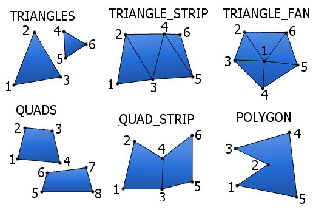

## ядро coreGL

> [!NOTE]
> ```sh
> Ядро coreGL это мой проект написанный на c++
> Главная цель - уменьшить кол-во кода
> Библиотеки использованные мной: openGL, glfw, glew, glm, openAL, stb_image
> ```

> [!WARNING]
>```sh
> Требуется windows x64
> Работает по умолчанию на версии openGL 4.6(но это можно поменять)
>```

## Использование ядра
```sh
самый простой способ это открыть проект в visual studio(файл core.sh)
второй способ для отчайных это скопировать содержимое из src/core в свой проект

и втом, и в другом случае для использования функций ядра, надо 
подключать заголовочный файл src/core/core.hpp
```


## Настройка проекта
>[!NOTE]
>```sh
> если вы используете visual studio, убедитесь что режим компиляции - reales, а не debug
>```

+ в заголовочный файле src/core/core.hpp можно произвести настройку ядра:
```cpp
4  // версия openGL(4.6)
5  constexpr unsigned char VERSION_MAJOR = 4;
6  constexpr unsigned char VERSION_MINOR = 6;
7 
8  // разрешить изменения размера окна(окон)
9  constexpr bool WINDOW_RESIZABLE = true;
10
11 // разрешить получение информации о состояние разных процессов
12 constexpr bool CORE_INFO = true;
```

## структура ядра
:open_file_folder: core 
>:file_folder: audio\
>:file_folder: data\
>:file_folder: graphics\
>:file_folder: util\
>:file_folder: window\
>:page_facing_up: core.hpp

core.hpp это заголовочный файл, включает все инструменты ядра\
audio, data, file, graphics, util, window - это системы ядра, на каждой из них мы остановимя ниже

## инициализация ядра
``` cpp
#include "core/core.hpp"

int main()
{
    // инициализирует ядро
    core::Init();

    // ваш код
    //gggfsd\hfrds\
    //rh\ztzj
    //\zrhjtz\

    // освобождает память
    core::Terminate();
	return 0;
}
```

## система window

``` cpp
Window window("openGL", 1280, 720);
// этот конструктор создаёт объект окна и само окно с название openGL, и размером 1280x720
// для тех кто не знаком с c++, window - это название объекто, туту может быть любое название

winodw.~Window();
// этот деструктор удаляет объект окна и само окно

window.setContext();
// устанавливает данный объект в качестве контекста(то где мы рендерим)

window.swapBuffers();
// сменяет буфферы
// swapBuffers(bool fill = true, float red = 0, float green = 0, float blue = 0, float alhpa = 0)
// а также она подгатавливает буфер закрашивая его в чёрный(по умолчанию)
// fill - разрешает закрашивать буфер(по умолчанию true),
// red, green, blue, alpha устанавливают цвет(от 0.0 до 1.0) (по умолчанию 0)

window.setSizeBuffer(int width, int height);
// устанавливает размер буфера(если что, это то, где мы рисуем)

window.width, window.height
// переменные(тип int), которые хранят текущий размер окна

window.setIcon(const char* path);
// устанавливает иконку для окна, принимает путь к png файлу

window.isContext();
// если данное окно является контекстом, возвращает true, иначе false

window.event->update();
// обновляет буфер эвентов

window.event->close();
// возвращает true, если сработает эвент закрытия окна(кто то нажмёт на крестик), иначе false

window.close();
// заставляет функцию window.event->close() вернуть true 

window.event->GetMouseLeftButton();
// возвращает true если нажата ЛКМ, иначе false

window.event->GetMouseRightButton();
// возвращает true если нажата ПКМ, иначе false

window.event->getKey(Key_code key);
window.event->getKey(int key);
// обе функции возвращают true если нажата клавиша
// верхняя функция в разработке и она принимает названия K_ESCAPE, K_W и т.д.
// нижняя принимает номер клавиши в стандарте библиотеки GLFW

window.cursor->setCursorMode(int mode);
// устанавливает режим курсора, номер режим соответствует стандарту библиотеки GLFW
// (ни разу не использовал эту функцию:) )

window.cursor->showCursor(bool flag);
// делает курсор прозрачным если передать true

window.cursor->disableCursor(bool flag);
// выключает курсор ели передать true
// русским языком, убирает ограничения(края монитора) для курсора, 
// его можно будет передвигать за зону видимости

window.cursor->setPosition(double x, double y);
// устанавливает курсор на указанные координаты

window.cursor->getCordCursorX();
// возвращает координаты курсора по x

window.cursor->getCordCursorY();
// возвращает координаты курсора по y

window.cursor->getCordCursor(double& x, double& y);
// передаёт координаты курсора в переменные по их адресу

// пример как создать кастомный курсор
Cursor::custom_cursor* c = window.cursor->create("cursor.png", 0, 0);
// этот конструктор принимает путь к png картике и координаты
c->use();
// устанавливает созданный курсор в качестве остновного
// с - это объект, можно использовать любое название
```

## Система vao(vertex array object)
``` cpp
// VAO - это главный массив, он хранится в ГПУ, и его будет отрисовывать openGL
// по сути это то, что мы рисуем
// VAO может быть столько, на сколько памяти ГПУ хватит

// есть два способа работать с VAO:

// первый способ

vao::create(float* data, int sizeOfByte);
vao::create(std::vector<float> data);
// обе функции загружают массив данных в ГПУ, и возваращают(unsigned int) номер этого массива
// первая функция принимает указатель на массив и его размер в байтах
// вторая функция принимает вектор

vao::addAttribute(unsigned int id, int index, int n, int size, int indentation);
// эта функция добавляет вершинный атрибут, что это такое поговорим в главе о шейдерах
// id - это номер массива в ГПУ
// index - это номер вершинного атрибута
// n - кол-во элементов для данного атрибута
// size - кол-во элементов на вершину
// indentation - смещение в массиве(то есть, с какого элемента начнётся атрибут) 

vao::Delete(unsigned int id);
// удаляет vao по его номеру

vao::DeleteALL();
// удаляет все vao

vao::bind(unsigned int id);
// включает vao по его номеру

vao::draw(primitive Primitive, int first_vert, int count_vert);
// рисует включенный vao
// принимает вид примитива, про их виды я напишу в конце этой главы
// принимает номер первой вершины, и номер последней вершины

vao::draw(primitive Primitive, unsigned int VAO, int first_vert, int count_vert);
// рисует vao (включает его автоматически)
// принимает номер vao
// принимает вид примитива, про их виды я напишу в конце этой главы
// принимает номер первой вершины, и номер последней вершины

// второй способ

VAO v(float* data, int sizeOfByte, int elementToVert);
VAO v(std::vector<float> data, int elementToVert);
// оба этих конструктора загружают массив данных в ГПУ и создают объкет v

// первый конструктор принимает указатель на массив, 
// его размер в байтах и кол-во элементов на одну вершину

// вторая конструктор принимает вектор и кол-во элементов на одну вершину

v.addAttribute(int index, int n, int indentation);
// эта функция добавляет вершинный атрибут, что это такое поговорим в главе о шейдерах
// index - это номер вершинного атрибута
// n - кол-во элементов для данного атрибута
// indentation - смещение в массиве(то есть, с какого элемента начнётся атрибут) 

v.~VAO();
// этот деструктор удаляет vao
// можно также использовать фукцию vao::DeleteALL(); она также удалит все vao

v.draw(primitive Primitive, int first_vert = 0, int count_vert = 0);
// рисует vao 
// принимает вид примитива, про их виды я напишу в конце этой главы
// принимает номер первой вершины, и номер последней вершины

// если последние два параметра не указать,
// то функция нарисет все вершины которые находятся в данном vao
```
## ПРИМИТИВЫ 

> [!WARNING]
> Обратите внимания в каком порядке рисуются вершины\
> QUADS, QUAD_STRIP, POLYGON в новой openGL, почему-то не работают



