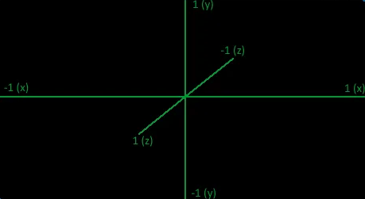
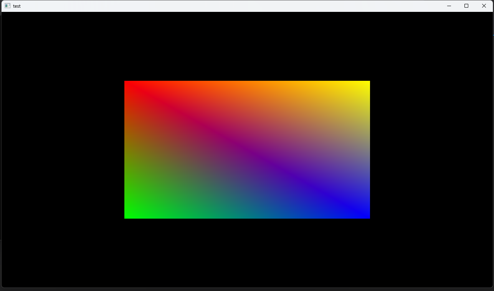
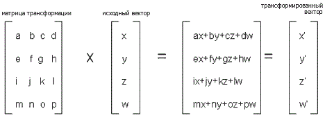
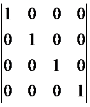
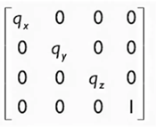
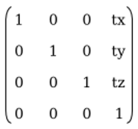
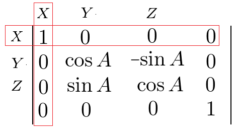
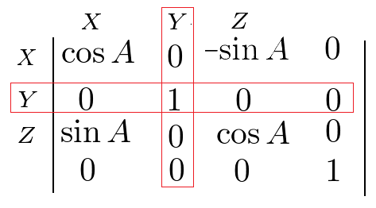
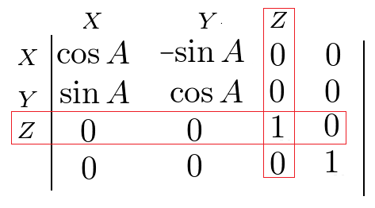
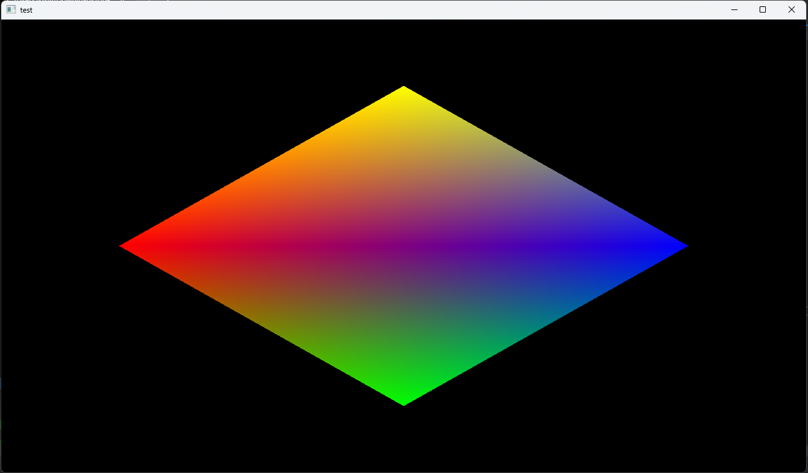

## ядро coreGL

> [!NOTE]
> ```sh
> Ядро coreGL это мой проект написанный на c++
> Главная цель - уменьшить кол-во кода
> Библиотеки использованные мной: openGL, glfw, glew, glm, openAL, stb_image
> ```

> [!WARNING]
>```sh
> Требуется windows x64
> Работает по умолчанию на версии openGL 4.6(но это можно поменять)
>```

## Использование ядра
```sh
самый простой способ это открыть проект в visual studio(файл core.sh)
второй способ для от чайных это скопировать содержимое из src/core в свой проект

и в том, и в другом случае для использования функций ядра, надо 
подключать заголовочный файл src/core/core.hpp
```


## Настройка проекта
>[!NOTE]
>```sh
> если вы используете visual studio, убедитесь что режим компиляции - reales, а не debug
>```

+ в заголовочный файле src/core/core.hpp можно произвести настройку ядра:
```cpp
4  // версия openGL(4.6)
5  constexpr unsigned char VERSION_MAJOR = 4;
6  constexpr unsigned char VERSION_MINOR = 6;
7 
8  // разрешить изменения размера окна(окон)
9  constexpr bool WINDOW_RESIZABLE = true;
10
11 // разрешить получение информации о состояние разных процессов
12 constexpr bool CORE_INFO = true;
```

## структура ядра
:open_file_folder: core 
>:file_folder: audio\
>:file_folder: data\
>:file_folder: graphics\
>:file_folder: util\
>:file_folder: window\
>:page_facing_up: core.hpp

core.hpp это заголовочный файл, включает все инструменты ядра\
audio, data, file, graphics, util, window - это системы ядра, на каждой из них мы остановимся ниже

## инициализация ядра
``` cpp
#include "core/core.hpp"

int main()
{
    // инициализирует ядро
    core::Init();

    // возвращает(double) время в секундах пройденное с момента инициялизации ядра
    core::GetTime();

    // ваш код
    //gggfsd\hfrds\
    //rh\ztzj
    //\zrhjtz\

    // освобождает память
    core::Terminate();
	return 0;
}
```

## система window

``` cpp
Window window("openGL", 1280, 720);
// этот конструктор создаёт объект окна и само окно с название openGL, и размером 1280x720
// для тех кто не знаком с c++, window - это название объекта, тут может быть любое название

winodw.~Window();
// этот деструктор удаляет объект окна и само окно

window.setContext();
// устанавливает данный объект в качестве контекста(то где мы рендерим)

window.swapBuffers();
// сменяет буферы
// swapBuffers(bool fill = true, float red = 0, float green = 0, float blue = 0, float alhpa = 0)
// а также она подготавливает буфер закрашивая его в чёрный(по умолчанию)
// fill - разрешает закрашивать буфер(по умолчанию true),
// red, green, blue, alpha устанавливают цвет(от 0.0 до 1.0) (по умолчанию 0)

window.setSizeBuffer(int width, int height);
// устанавливает размер буфера(если что, это то, где мы рисуем)

window.width, window.height
// переменные(тип int), которые хранят текущий размер окна

window.setIcon(const char* path);
// устанавливает иконку для окна, принимает путь к png файлу

window.isContext();
// если данное окно является контекстом, возвращает true, иначе false

window.event->update();
// обновляет буфер эвентов

window.event->close();
// возвращает true, если сработает эвент закрытия окна(кто то нажмёт на крестик), иначе false

window.close();
// заставляет функцию window.event->close() вернуть true 

window.event->GetMouseLeftButton();
// возвращает true если нажата ЛКМ, иначе false

window.event->GetMouseRightButton();
// возвращает true если нажата ПКМ, иначе false

window.event->getKey(Key_code key);
window.event->getKey(int key);
// обе функции возвращают true если нажата клавиша
// верхняя функция в разработке и она принимает названия K_ESCAPE, K_W и т.д.
// нижняя принимает номер клавиши в стандарте библиотеки GLFW

window.cursor->setCursorMode(int mode);
// устанавливает режим курсора, номер режим соответствует стандарту библиотеки GLFW
// (ни разу не использовал эту функцию:) )

window.cursor->showCursor(bool flag);
// делает курсор прозрачным если передать true

window.cursor->disableCursor(bool flag);
// выключает курсор ели передать true
// если русским языком, она убирает ограничения(края монитора) для курсора, 
// его можно будет передвигать за зону видимости

window.cursor->setPosition(double x, double y);
// устанавливает курсор на указанные координаты

window.cursor->getCordCursorX();
// возвращает координаты курсора по x

window.cursor->getCordCursorY();
// возвращает координаты курсора по y

window.cursor->getCordCursor(double& x, double& y);
// передаёт координаты курсора в переменные по их адресу

// пример как создать кастомный курсор
Cursor::custom_cursor* c = window.cursor->create("cursor.png", 0, 0);
// этот конструктор принимает путь к png картинке и координаты
c->use();
// устанавливает созданный курсор в качестве основного
// с - это объект, можно использовать любое название
```

## Система vao(vertex array object)
``` cpp
// VAO - это главный массив, он хранится в ГПУ, и его будет отрисовывать openGL
// по сути это то, что мы рисуем
// VAO может быть столько, на сколько памяти ГПУ хватит

// есть два способа работать с VAO:

// первый способ

vao::create(float* data, int sizeOfByte);
vao::create(std::vector<float> data);
// обе функции загружают массив данных в ГПУ, и возвращают(unsigned int) номер этого массива
// первая функция принимает указатель на массив и его размер в байтах
// вторая функция принимает вектор

vao::addAttribute(unsigned int id, int index, int n, int size, int indentation);
// эта функция добавляет вершинный атрибут, что это такое поговорим в главе о шейдерах
// id - это номер массива в ГПУ
// index - это номер вершинного атрибута
// n - кол-во элементов для данного атрибута
// size - кол-во элементов на вершину
// indentation - смещение в массиве(то есть, с какого элемента начнётся атрибут) 

vao::Delete(unsigned int id);
// удаляет vao по его номеру

vao::DeleteALL();
// удаляет все vao

vao::bind(unsigned int id);
// включает vao по его номеру

vao::draw(primitive Primitive, int first_vert, int count_vert);
// рисует включенный vao
// принимает вид примитива, про их виды я напишу в конце этой главы
// принимает номер первой вершины, и номер последней вершины

vao::draw(primitive Primitive, unsigned int VAO, int first_vert, int count_vert);
// рисует vao (включает его автоматически)
// принимает номер vao
// принимает вид примитива, про их виды я напишу в конце этой главы
// принимает номер первой вершины, и номер последней вершины

// второй способ

VAO v(float* data, int sizeOfByte, int elementToVert);
VAO v(std::vector<float> data, int elementToVert);
// оба этих конструктора загружают массив данных в ГПУ и создают объект v

// первый конструктор принимает указатель на массив, 
// его размер в байтах и кол-во элементов на одну вершину

// вторая конструктор принимает вектор и кол-во элементов на одну вершину

v.addAttribute(int index, int n, int indentation);
// эта функция добавляет вершинный атрибут, что это такое поговорим в главе о шейдерах
// index - это номер вершинного атрибута
// n - кол-во элементов для данного атрибута
// indentation - смещение в массиве(то есть, с какого элемента начнётся атрибут) 

v.~VAO();
// этот деструктор удаляет vao
// можно также использовать функцию vao::DeleteALL(); она также удалит все vao

v.draw(primitive Primitive, int first_vert = 0, int count_vert = 0);
// рисует vao 
// принимает вид примитива, про их виды я напишу в конце этой главы
// принимает номер первой вершины, и номер последней вершины

// если последние два параметра не указать,
// то функция нарисует все вершины которые находятся в данном vao
```
## ПРИМИТИВЫ 

> [!WARNING]
> Обратите внимание в каком порядке рисуются вершины\
> QUADS, QUAD_STRIP, POLYGON в новой openGL, почему-то не работают
> 

## Координаты в openGL
> [!WARNING]
> Обратите внимание как задаются координаты в openGL\
> в openGL ось z повёрнута в противоположную сторону, это надо учесть
> 
> 


## Система shader
>[!NOTE]
> Что такое шейдер - это специальная промежуточная программа, которая выполняется в ГПУ\
> Шейдер или Шейдерная программа состоит из нескольких шейдеров\
> В наше время ни чего без шейдеров не рисуется

>+ Виды и порядок выполнение шейдеров:
>>1. вершинный
>>2. шейдер тесселяция
>>3. геометрический
>>4. шейдер растеризации
>>5. фрагментный

+ в моём ядре пока что реализован только вершинный и фрагментный шейдер
  
+ вершинный шейдер отвечает за вычисление положений вершин в пространстве
+ фрагментный шейдер отвечает за раскрашивание вершин и расчёт цветов

шейдеры пишутся на языке glsl(GL shader language)

+ Версии OpenGL для glsl

| OpenGL |       GLSL        |
| :----: | :---------------: |
|  2.0   |       1.10        |
|  2.2   |       1.20        |
|  3.0   | 1.10, 1.20 и 1.30 |
|  3.1   |    1.30 и 1.40    |
|  3.2   |    1.40 и 1.50    |
|  3.3   |       3.30        |
|  4.0   |       4.00        |
|  4.1   |       4.10        |
|  4.2   |  от 1.40 до 4.20  |
|  4.6   |  от 1.40 до 4.60  |

синтаксис glsl(похож на си)

``` glsl
#version 460 core
// этой строчкой мы устанавливаем версию glsl 
// 460 соответсвует версия 4.60 и т.д.

// все типы данных:

// векторы
vec2, vec3, vec4 хранят тип float
bvec2, bvec3, bvec4 хранят тип bool
ivec2, ivec3, ivec4 хранят типа int
uvec2, uvec3, uvec4 хранят тип unsigned int
dvec2, dvec3, dvec4 хранят тип double

// пример работы с вектором

vec4 pos = vec4(1, 1, 1, 1);
//              x, y, z, w
//каждой цифре соответсвует индекс

// пример присваивания значений вектору
pos.x = 0;
pos.y = 0;
pos.z = 0;
pos.w = 0;

pos = vec4 (1, 1, 1, 1);
pos.xyzw = vec4 (1, 1, 1, 1);
pos.xyz = vec3(1, 1, 0);
pos.xy = vec2(1, 1);
pos.yz = vec2(1, 1);

pos = vec4(vec2(1, 3), 0, 2);
pos = vec4(0, vec2(1, 3), 2);
pos = vec4(vec3(1, 3, 0), 2);

// переменные
bool, int, uint, float, double

// стандартные матрицы 
mat4 Матрица 4х4
mat3 Матрица 3х3
mat2 Матрица 2х2

// не симметричные матрицы
mat2x3 Матрица 2х3
mat2x4 Матрица 2х4
mat3x2 Матрица 3x2
mat3x4 Матрица 3x4
mat4x2 Матрица 4x2
mat4x3 Матрица 4x3

gl_Position - это встроенная переменая
// она принимает координаты текущей вершины в виде vec4
// с помощью этой переменной мы объясняем ГПУ где рисовать вершину
// эта переменная может использоваться только в вершинном шейдере

out тип название //передаём
in тип название //принимаем
// с помощью этих команд мы можем передавать переменную из одного шейдера в другой
// в нашем случае это работает по принципу: 
// "Из вершинного в фрагментный, но не в обратную сторону" 
```

## ТЕПЕРЬ ПОГОВОРИМ ПРО АТРИБУТЫ VAO
```cpp
// создадим вектор с координатами вершин треугольника
// и c цветами вершин
std::vector<float> vert {
    //x, y, r, g, b
      0, 0, 1, 0, 0, // первая вершина
      0, 1, 0, 1, 0, // вторая вершина
      1, 0, 0, 0, 1  // третья вершина
};

// создадим vao
VAO vao(vert, 5);
// обратите внимания, что я передаю 5,
// т.к. на одну вершину 5 элементов: x, y, r, g, b

// теперь мы должны объединить шейдер и vao, для этого используются атрибуты
vao.addAttribute(0, 2, 0);
// этой функцией мы сказали что первые два элемента вершину будут иметь индекс 0

vao.addAttribute(1, 3, 2);
// этой функцией мы сказали что последние три элемента вершину будут иметь индекс 1
```

## рассмотрим в начале вершинный шейдер
``` glsl
#version 460 core
//это строчка обозначает версию glsl 4.60

layout (location = 0) in vec2 pos;
// этой строчкой мы привязываем атрибут с индексом 0 к переменной pos
// цифра 0 - это индекс атрибута который мы написали при создание атрибута

layout (location = 1) in vec3 color;
// этой строчкой мы привязываем атрибут с индексом 1 к переменной v_color
// цифра 1 - это индекс атрибута который мы написали при создание атрибута

out vec3 v_color;
// отправляем переменную v_color в фрагментный шейдер

void main()
{                   //vec2,   z,   w
    gl_Position = vec4(pos, 0.0, 1.0);
    // это переменная она встроена в glsl и в неё передаются координаты вершины
    v_color = color;

}
```

## теперь рассмотрим фрагментный шейдер

``` glsl
#version 460 core

out vec4 f_color;
// эта строчка говорит что переменная f_color будет цветом вершины
// в openGL есть понятие: конвеер, так вот эта строчка
// передаёт цвет дальше по ковееру (это просто надо запомнить)

in vec3 v_color;
// этой строчкой мы получаем переменную f_color из вершинного шейдера

void main()
{               // vec3,    a
    f_color = vec4(v_color, 1);
}
```

## вернёмся в систему Shader

Что бы хоть что то увидеть на экране,\
нам надо скомпилировать шейдеры в шейдерную программу и загрузить её в ГПУ\
Как и в случае с vao шейдерные программы имеют свои номера в памяти ГПУ

тут есть два способа:

первый

```cpp
shader::createFromFile(const char* pathVert, const char* pathFrag);
// функция принимает путь к вершинному и фрагментному шейдеру
// компилирует их в ГПУ, и возвращает(unsigned int) номер шейдерной программы

shader::use(unsigned int id);
// говорит ГПУ какой шейдер использовать, принимает номер шейдерной программы

shader::Delete(unsigned int id);
// удаляет шейдерную программу, принимает номер шейдерной программы

shader::DeleteALL();
// удаляет все шейдерные программы

// все функции которые ниже, позволяют передавать значения в переменные шейдера
shader::UniformMat4(glm::mat4 matrix, const char* name);
shader::Uniform1F(const float value, const char* name);
shader::Uniform2F(glm::vec2 vec2, const char* name);
shader::Uniform3F(glm::vec3 vec3, const char* name);
shader::Uniform4F(glm::vec4 vec4, const char* name);

shader::Uniform1I(glm::ivec1 value, const char* name);
shader::Uniform2I(glm::ivec2 value, const char* name);

// для этого в шейдере создаются unifrom переменные
// Пример: uniform vec4 color;

// далее в с++ мы используем такую функцию(или другую из списка):
shader::Uniform4F(glm::vec4(1, 1, 1, 1), "color");
// этой функцией мы передали вектор glm::vec4(1, 1, 1, 1), в переменую color

// обратите внимания для работы с векторами и матрицами используется библиотека glm
// (ниже я расскажу про матричные преобразования и библиотеку glm)
```

второй способ
```cpp
Shader shader(const char* pathVert, const char* pathFrag);
// конструктор принимает путь к вершинному и фрагментному шейдеру
// компилирует их в ГПУ, и создаёт объект shader(ну или с вашим названием)

shader.~Shader();
// деструктор удаляет шейдерную программу

shader::DeleteALL();
// удаляет все шейдерные программы

shader.use();
// говорит ГПУ использовать данный шейдер

// делают всё тоже что и в первом способе:
shader.UniformMat4(glm::mat4 matrix, const char* name);
shader.Uniform1F(const float value, const char* name);
shader.Uniform2F(glm::vec2 vec2, const char* name);
shader.Uniform3F(glm::vec3 vec3, const char* name);
shader.Uniform4F(glm::vec4 vec4, const char* name);

shader.Uniform1I(glm::ivec1 value, const char* name);
shader.Uniform2I(glm::ivec2 value, const char* name);
```

## Матрицы, векторы, проецирование и библиотека GLM
Для начала напишем код который будет рисовать четырёхугольник

файл main.cpp
```cpp
// подключаем ядро
#include "core/core.hpp"

// объявляем вектор с координатами и цветами вершин
std::vector<float> vertex
{
//     x    y    z    r    g    b
// первый треугольник
	-0.5, 0.5, 0.0, 1.0, 0.0, 0.0,
	-0.5,-0.5, 0.0, 0.0, 1.0, 0.0,
	 0.5,-0.5, 0.0, 0.0, 0.0, 1.0,
// второй треугольник
	-0.5, 0.5, 0.0, 1.0, 0.0, 0.0,
	 0.5,-0.5, 0.0, 0.0, 0.0, 1.0,
	 0.5, 0.5, 0.0, 1.0, 1.0, 0.0
};
// обратите внимание что z = 0, это потому что openGL 
// без матриц преобразования рисует только 2D
// и если я сейчас напишу (z = любое число), то вы не увидите разницы

// главная функция
int main()
{
    // обработка исключений
    // в моём ядре нет смысла выводить исключение в консоль,
    // оно и так автоматически выведется, вам лишь достаточно его поймать
	try
	{
        // инициализируем ядро
		core::Init();

        // создаём окно
		Window window("test", 1280, 720);

        // назначаем окно контекстом
		window.setContext();

        // создаём vao
        // напомню что цифра 6 - обозначает кол-во элементов на вершину
        // у нас это три координаты: x, y, z и три канала цвета: r, g, b 
		VAO vao(vertex, 6);

        // назначаем первым трём элементом вершины атрибут с индексом 0
		vao.addAttribute(0, 3, 0);

        // назначаем вторым трём элементом вершины атрибут с индексом 1
		vao.addAttribute(1, 3, 3);

        // загружаем шейдеры, код шейдера будет ниже
		Shader shader("vert.glsl", "frag.glsl");

        // главный цикл, работает пока вы не нажмёте на крестик окна
		while (!window.event->close())
		{
            // обновляем объект событий
			window.event->update(); 

            // назначаем нашу шейдерную программу
			shader.use();

            // рисуем вершины
			vao.draw(TRIANGLE);
            // обратите внимание, что я не передаю кол-во вершин,
            // эта функция может их считать автоматически

            // сменяем буфер
			window.swapBuffers();
		}
	}
	catch (...)
	{ 
        // выключаем ядро
		core::Terminate();

        // возвращаем код ошибки
		return -1;
	}

    // выключаем ядро
	core::Terminate();
	return 0;
}

```

vert.glsl - вершинный шейдер(название и расширение можно выбрать любое)
```glsl
#version 460 core
// версия glsl(у нас последняя как и openGL)

// подключаем атрибут 0 к вектору pos
layout (location = 0) in vec3 pos;

// подключаем атрибут 1 к вектору color
layout (location = 1) in vec3 color;

// отправляем вектор v_color в фрагментный шейдер
out vec3 v_color;

// главная функция
void main()
{
    // думаю понятно
	v_color = color;

    // говорим ГПУ что координаты вершины это вектор pos и 1.0
    // почему так? OpenGL использует четыре координаты x, y, z, w
    // w - это трансформация пока-что оставляем = 1
	gl_Position = vec4(pos, 1.0);
}
```

frag.glsl - фрагментный шейдер(название и расширение можно выбрать любое)
``` glsl
#version 460 core
// версия glsl(у нас последняя как и openGL)

// получаем вектор из вершинного шейдера
in vec3 v_color;

// отправляем f_color дальше по конвееру
// (это то вектор, который будет обозначать цвет вершины)
// он четырёхмерный red, green, blue, alpha
out vec4 f_color;

void main()
{
    // обратите внимание alpha у нас будет = 1, пока-что
	f_color = vec4(v_color, 1.0f);
}
```

вот что вы должны получить


как вы могли заметить не смотря на равные координаты,\
наш четырёхугольник не похож на квадрат,\
это из за того, что буфер в openGL по x от -1 до 1 и по y от -1 до 1
что бы это исправить нужны матрицы преобразования

>[!NOTE]
> Что такое матрица - это математический объект, записываемый в виде прямоугольной таблицы\
> элементов кольца или поля (например, целых, действительных или комплексных чисел)\
>
> Матрицы используются для преобразования координат вершин
>
> Вектор - это(забудьте то что вам говорит на математике) структура с\
> переменными, хранящими координаты

\
вот пример умножения матрицы на вектор(таким образом\
можно вращать, перемещать, масштабировать, проецировать модель на экран)

Виды матриц:

1. единичная(при умножение на вектор, он не изменяется)\


2. матрица масштабирования\
\
где q - это коэффициент масштабирования по определённой оси

3. матрица перемещения\
\
где t - значение на которое будет перемещён вектор по определённым осям

1. матрицы вращения:\
По оси X\
\
По оси Y\
\
По оси Z\
\
Обратите внимания на закрашенный линии, матрица\
выстраивается относительно этих линий\
Короче эти линии для наглядности и обозначают ту ось\
по которой будет происходить вращение\
A - угол поворота

Простите за кривые картинки, я не художник :)

Для того, что бы всё то что было написано сверху не запоминать в ядре есть библиотека GLM\
Теперь об этой библиотеки

файл main.cpp доработаем его
```cpp
            // назначаем нашу шейдерную программу
            shader.use();

            // создаём единичную матрицу matrix
		    glm::mat4 matrix = glm::mat4(1.0f);

            // отправляем матрицу (matrix) в шейдерную 
            // uniform переменную matrix
		    shader.UniformMat4(matrix, "matrix");

		    // рисуем вершины
		    vao.draw(TRIANGLE);
		    // обратите внимание, что я не передаю кол-во вершин,
		    // эта функция может их считать автоматически
```

файл vert.glsl, доработаем шейдер
``` glsl
#version 460 core
// версия glsl(у нас последняя как и openGL)

// подключаем атрибут 0 к вектору pos
layout (location = 0) in vec3 pos;

// подключаем атрибут 1 к вектору color
layout (location = 1) in vec3 color;

// отправляем вектор v_color в фрагментный шейдер
out vec3 v_color;

// создаём unifrom матрицу matrix
uniform mat4 matrix;

// главная функция
void main()
{
    // думаю понятно
	v_color = color;

    // говорим ГПУ что координаты вершины это вектор pos и 1.0
    // почему так? OpenGL использует четыре координаты x, y, z, w
    // w - это трансформация пока-что оставляем = 1
    // для трансформации мы умножаем матрицу на ветор позиции
	gl_Position = matrix * vec4(pos, 1.0);
}
```

если всё сделали как я, то вы увидите тот же четырёхугольник

теперь мы можем поиздеваться на нашем четырёхугольником\
вернёмся в main.cpp
```cpp
            // назначаем нашу шейдерную программу
            shader.use();

            // создаём единичную матрицу matrix
		    glm::mat4 matrix = glm::mat4(1.0f);

            // выстраиваем матрицу вращения с помощью glm::rotate()
            // эта функция возвращает mat4 матрицу
            // принимает матрицу которую будем вращать,
            // угол поворота в радианах, я использовал glm::radians(45.0f),
            // она превращает градусы в радианы,
            // и последний аргумент - это vec3 вектор,
            // который говорит по какой(каким) осям вращать
			matrix = glm::rotate(
                matrix,              //матрица
                glm::radians(45.0f), //угол поворота в радианах
                glm::vec3(0, 0, 1)   //по каким осям вращать x, y, z
            ); 

            // отправляем матрицу (matrix) в шейдерную 
            // uniform переменную matrix
		    shader.UniformMat4(matrix, "matrix");

		    // рисуем вершины
		    vao.draw(TRIANGLE);
		    // обратите внимание, что я не передаю кол-во вершин,
		    // эта функция может их считать автоматически
```

вы получите


```cpp
matrix = glm::rotate(
	matrix,
	glm::radians(float(core::GetTime() * 20.0)),
	glm::vec3(1, 0, 1)
);

```
Теперь мы можем наблюдать:\


## Система Camera
>[!NOTE]
> Камера в моём ядре - это калькулятор который подсчитывает две матрицы(вида и проекции)\
> 
> Для проекции объектов на экран надо в вершинном шейдере\
> умножать матрицу проекции на матрицу вида и на координаты вершины\
> обратите внимание на порядок переменожения матриц, он должен быть именно таким
>
> где взять эти матрицы я напишу ниже

```cpp
Camera cam(float posX, float posY, float posZ, float fov, float distance);
// создаёт объект камеры cam (или ваше название)
// принимает координаты x, y, z, область видемости(советую использовать 60-70),
// а так же зону видемости камеры - это 
// растояние до последнего объекта, который будет видеть камера

cam.rotate(float x, float y, float z);
// поварачивает камеру по указанным осям
// функция принимает то на сколько надо повернуть матрицу

cam.resetRotate();
// эта функция сбрасывает матрицу вращения
// поварачивает камеру на начальную точку

cam.move(float x, float y, float z);
// перемещает камеру по указаным осям

cam.setPos3f(glm::vec3 pos);
// устанавливает позицию камеры
// принимает координаты записанные в вектор

cam.setPos(float x, float y, float z);
// устанавливает позицию камеры
// принимает координаты по x, y, z

cam.getPos3f(glm::vec3 &pos);
// получает координаты камеры
// принимает вектор в который будут записаны координаты

cam.getPos(float &x, float &y, float &z);
// получает координаты камеры
// принимает переменные в которые будут записаны координаты

// вот те функции которые возвращают матрицы:
cam.getProj(int width, int height);
// эта функция возвращает(glm::mat4) матрицу проекции
// и принимает ширину и высоту окна(буффера)

cam.getView();
// эта функция возвращает(glm::mat4) матрицу вида

// остаётся передать их в вершинный шейдер и посчитать по формуле:
// gl_Position = матрица_проекции * матрица_вида * координаты вершин

```
